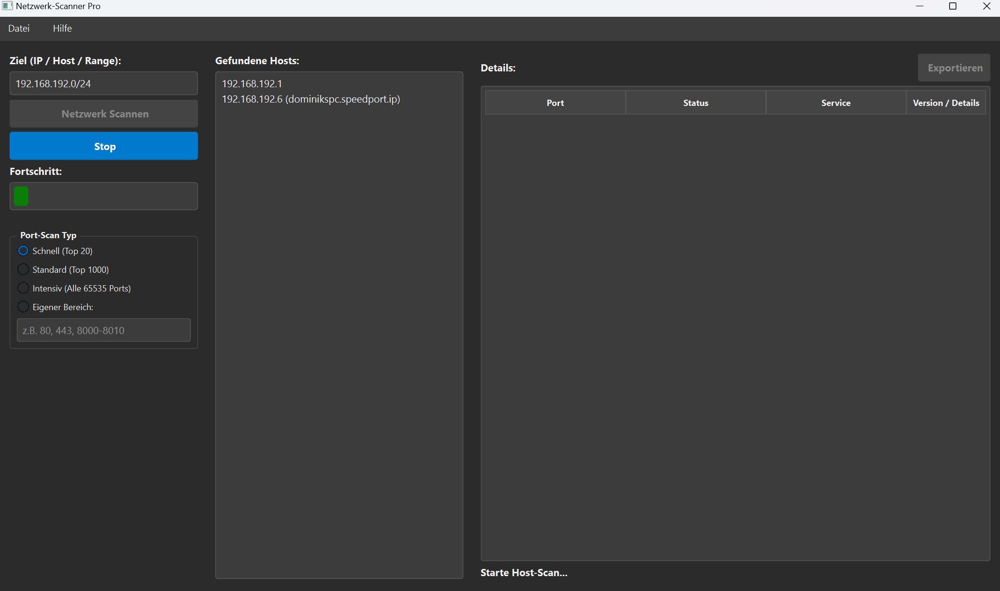

# Netzwerk-Scanner Pro v1.0

Ein benutzerfreundlicher, grafischer Netzwerk-Scanner für Windows, geschrieben in Python mit PySide6. Dieses Tool ermöglicht es, schnell und effizient aktive Hosts in einem Netzwerk zu entdecken und deren offene Ports zu überprüfen.

## Hauptfunktionen

*   **Automatische Netzwerkerkennung:** Schlägt beim Start automatisch den lokalen Netzwerkbereich vor.
*   **Host Discovery:** Findet aktive Hosts im Zielnetzwerk mittels Ping und zeigt IP-Adressen sowie (falls auflösbar) Hostnamen an.
*   **Multi-Threaded Port-Scanner:** Scannt ausgewählte Hosts auf offene Ports mit verschiedenen Scan-Tiefen:
    *   **Schnell:** Überprüft die Top 20 der häufigsten Ports.
    *   **Standard:** Überprüft die Top 1000 der häufigsten Ports.
    *   **Intensiv:** Überprüft alle 65.535 TCP-Ports.
    *   **Benutzerdefiniert:** Ermöglicht die Angabe eigener Ports und Bereiche (z.B. `80, 443, 8000-8010`).
*   **Diensterkennung:** Nutzt die Power von **Nmap** im Hintergrund, um Dienste und deren Versionen auf offenen Ports zu identifizieren.
*   **Export-Funktion:** Speichert die detaillierten Port-Scan-Ergebnisse als übersichtliche CSV-Datei.
*   **Einfacher Installer:** Wird als `.exe`-Installer geliefert, der die wichtige Nmap-Abhängigkeit automatisch und unsichtbar für den Benutzer mitinstalliert.

## Download & Installation

Die neueste Version kann einfach über die Releases-Seite heruntergeladen werden.

1.  Gehen Sie zur **[Releases-Seite](https://github.com/Ihr-GitHub-Benutzername/Netzwerk-Scanner-Pro/releases)**.
2.  Laden Sie die `Netzwerk-Scanner-Pro-Setup.exe` der aktuellsten Version herunter.
3.  Führen Sie die Setup-Datei aus und folgen Sie den Anweisungen. Nmap wird automatisch mitinstalliert.

## Technische Details

*   **Sprache:** Python 3
*   **GUI-Framework:** PySide6 (offizielle Qt for Python Bindings)
*   **Kern-Engine:** Nutzt `nmap` über `subprocess` für zuverlässige Scan-Ergebnisse.
*   **Plattform:** Derzeit für Windows optimiert. Eine plattformübergreifende Erweiterung für macOS und Linux ist in Arbeit.

## Hinweis zu Antiviren-Programmen

Da dieses Tool Netzwerk-Scan-Funktionen (wie Nmap) nutzt, die auch für bösartige Zwecke verwendet werden können, könnten einige Antivirenprogramme eine Warnung (False Positive) anzeigen, insbesondere weil die Anwendung noch nicht weit verbreitet ist. Dies ist zu erwarten. Die Anwendung ist sicher und Open Source – Sie können den Quellcode in diesem Repository jederzeit überprüfen.

## Lizenz

Dieses Projekt steht unter der [MIT License](LICENSE).
